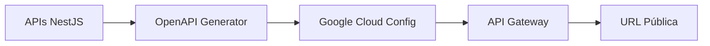

# 🌐 API Gateway con Google Cloud

Esta documentación describe el sistema completo de generación y gestión de API Gateway para Google Cloud usando especificaciones OpenAPI reales extraídas de tus APIs NestJS.

## 📋 Tabla de Contenidos

- [🏗️ Arquitectura](#️-arquitectura)
- [⚙️ Configuración](#️-configuración)
- [🚀 Uso Rápido](#-uso-rápido)
- [📝 Comandos Disponibles](#-comandos-disponibles)
- [🔧 Scripts Internos](#-scripts-internos)
- [🌍 Variables de Entorno](#-variables-de-entorno)
- [🐛 Troubleshooting](#-troubleshooting)

---

## 🏗️ Arquitectura

El sistema está compuesto por tres componentes principales:



### **Flujo de trabajo:**

1. **📊 Extracción**: Lee la configuración real de Swagger de tus APIs NestJS
2. **🔄 Conversión**: Convierte OpenAPI 3.0 → Swagger 2.0 (requerido por Google Cloud)
3. **☁️ Optimización**: Añade configuraciones específicas de Google Cloud
4. **🚀 Deploy**: Crea configuración en Google Cloud API Gateway
5. **🌐 Gateway**: Crea puerta de enlace pública con URL accesible

---

## ⚙️ Configuración

### **1. Variables de Entorno**

Crea los archivos de entorno basándote en los ejemplos:

```bash
# Para desarrollo
cp .env.development.example .env.dev

# Para producción
cp .env.production.example .env.prod
```

### **2. Configuración de Google Cloud**

Ejecuta el setup inicial una sola vez:

```bash
npm run gcp:setup
```

Este comando:

- ✅ Habilita APIs necesarias
- ✅ Crea cuenta de servicio
- ✅ Configura permisos
- ✅ Prepara API Gateway base

---

## 🚀 Uso Rápido

### **Desarrollo (Flujo completo)**

```bash
# Generar, desplegar y crear gateway en un comando
npm run gateway:dev
```

### **Producción (Flujo completo)**

```bash
# Generar, desplegar y crear gateway para producción
npm run gateway:prod
```

### **Resultado esperado:**

```
🎉 ¡GATEWAY CONFIGURADO EXITOSAMENTE! 🎉

📡 Información del Gateway:
   🏷️  Nombre: mi-empresa-api-dev
   🔗 API: mi-empresa-api
   ⚙️  Config: config-dev-1758118214
   🌍 Región: us-central1
   🔗 URL: https://mi-empresa-api-dev-xxxxx.uc.gateway.dev

🧪 Prueba tus endpoints:
   curl -H "x-api-key: TU_API_KEY" https://mi-empresa-api-dev-xxxxx.uc.gateway.dev/users
   curl -H "x-api-key: TU_API_KEY" https://mi-empresa-api-dev-xxxxx.uc.gateway.dev/orders
```

---

## 📝 Comandos Disponibles

### **Comandos de Alto Nivel (Recomendados)**

| Comando                | Descripción                    | Uso                               |
| ---------------------- | ------------------------------ | --------------------------------- |
| `npm run gateway:dev`  | Flujo completo para desarrollo | Genera + Despliega + Crea gateway |
| `npm run gateway:prod` | Flujo completo para producción | Genera + Despliega + Crea gateway |

### **Comandos Granulares (Para debugging)**

| Comando                        | Descripción                   | Cuándo usar                  |
| ------------------------------ | ----------------------------- | ---------------------------- |
| `npm run openapi:generate:dev` | Solo generar spec             | Verificar contenido del spec |
| `npm run gateway:deploy:dev`   | Solo crear config en GCP      | Probar validación de Google  |
| `npm run gateway:create:dev`   | Solo crear/actualizar gateway | Cambiar config sin regenerar |

### **Comandos de Gestión**

| Comando                                    | Descripción                           |
| ------------------------------------------ | ------------------------------------- |
| `npm run gcp:setup`                        | Configuración inicial de Google Cloud |
| `bash tools/scripts/create-gateway.sh dev` | Gestión directa de gateway            |

---

## 🔧 Scripts Internos

### **1. Generador OpenAPI (`generate-openapi.ts`)**

**Ubicación:** `tools/openapi/scripts/generate-openapi.ts`

**Funcionalidades:**

- 🔍 **Auto-discovery**: Detecta APIs automáticamente vía variables `*_BACKEND_URL`
- 📦 **Carga dinámica**: Importa módulos NestJS en runtime
- 🏗️ **Extracción real**: Genera specs desde código real (no mock)
- 🔄 **Conversión**: OpenAPI 3.0 → Swagger 2.0 con `api-spec-converter`
- ☁️ **Optimización GCP**: Añade configuraciones específicas de Google Cloud

**Ejemplo de ejecución:**

```bash
node tools/openapi/scripts/generate-openapi.ts --output ${OPENAPI_OUTPUT_FILE} --protocol http
```

### **2. Gestor de Gateway (`create-gateway.sh`)**

**Ubicación:** `tools/scripts/create-gateway.sh`

**Funcionalidades:**

- 🔍 **Auto-detección**: Encuentra la configuración más reciente
- 🔄 **Gestión inteligente**: Crea o actualiza gateway según sea necesario
- 📊 **Feedback completo**: Muestra URL final y comandos de prueba
- 🌍 **Multi-entorno**: Soporte para dev/prod

**Ejemplo de ejecución:**

```bash
bash tools/scripts/create-gateway.sh dev
```

### **3. Wrapper Shell (`generate-openapi.sh`)**

**Ubicación:** `tools/openapi/scripts/generate-openapi.sh`

**Funcionalidades:**

- 📁 **Carga de entorno**: Importa variables desde `.env.*`
- ✅ **Validación**: Verifica dependencias y variables requeridas
- 🏗️ **Build**: Compila librerías de dominio necesarias
- 🔧 **Configuración**: Pasa parámetros correctos según entorno

---

## 🌍 Variables de Entorno

### **Variables Requeridas**

Todas las siguientes variables son **obligatorias** y deben estar definidas:

```bash
# URLs de tus APIs (patrón: *_BACKEND_URL)
USERS_BACKEND_URL=https://api-users-xxx.run.app/api
ORDERS_BACKEND_URL=https://api-orders-xxx.run.app/api

# Configuración del gateway
GATEWAY_API_NAME=mi-empresa-api           # Nombre del API en Google Cloud
BACKEND_PROTOCOL=https                    # http para dev, https para prod
GATEWAY_TITLE="Mi API Gateway"
GATEWAY_DESCRIPTION="Descripción del gateway"
GATEWAY_VERSION=1.0.0
OPENAPI_OUTPUT_FILE=openapi-gateway.yaml
ENVIRONMENT=dev                           # dev o prod

# Configuración de Google Cloud
GCP_PROJECT_ID=mi-proyecto-123         # ID del proyecto en Google Cloud
```

### **⚠️ Detalles de las variables de Google Cloud**

#### **`GCP_PROJECT_ID` (OBLIGATORIO)**

- ✅ **Para qué**: Deployment en Google Cloud API Gateway
- ❌ **Sin él**: El script falla inmediatamente con error claro
- 🎯 **Uso**: SIEMPRE requerido, no funciona sin él
- 🔒 **Validación**: Se valida al inicio del script

### **🔐 Método de autenticación:**

```bash
✅ x-api-key (header) - API Key en header (estándar de Google Cloud)
```

### **💡 Uso con API Key:**

```bash
# API Key en header (método seguro recomendado por Google)
curl -H "x-api-key: TU_API_KEY" https://gateway.com/users
curl -H "x-api-key: TU_API_KEY" https://gateway.com/orders
```

### **Auto-discovery de Servicios**

El sistema detecta automáticamente nuevos servicios siguiendo el patrón:

```bash
# Para agregar una nueva API, solo necesitas:
PAYMENTS_BACKEND_URL=https://api-payments-xxx.run.app/api
# ↓ Se detecta automáticamente como "payments" API
```

**Requisitos para auto-discovery:**

1. Variable termine en `_BACKEND_URL`
2. App existe en `apps/api-{nombre}/`
3. Módulo existe en `apps/api-{nombre}/src/app/app.module.ts` o `libs/{nombre}-domain/`

---

## 🐛 Troubleshooting

### **Errores Comunes**

#### **1. "No se encontraron servicios API configurados"**

```bash
❌ No se encontraron servicios API configurados.
```

**Solución:**

- Verifica que las variables `*_BACKEND_URL` estén definidas
- Confirma que las apps existan en `apps/api-*`
- Revisa el archivo `.env.dev` o `.env.prod`

#### **2. "Error cargando módulo"**

```bash
❌ Error cargando módulo para users
```

**Solución:**

- Verifica que el módulo exista en `apps/api-users/src/app/app.module.ts`
- O alternativamente en `libs/users-domain/src/lib/users-domain.module.ts`
- Ejecuta `nx build users-domain` antes de generar

#### **3. "Protocol field must be 'http/1.1' or 'h2'"**

```bash
❌ Protocol field in extension x-google-backend must be 'http/1.1' or 'h2'
```

**Solución:**

- El script ahora convierte automáticamente `http` → `http/1.1` y `https` → `h2`
- Si persiste, verifica que `BACKEND_PROTOCOL` esté configurado correctamente

#### **4. "Location southamerica-west1 is not found"**

```bash
❌ Location southamerica-west1 is not found or access is unauthorized
```

**Solución:**

- API Gateway no está disponible en todas las regiones
- El script usa `us-central1` automáticamente
- No necesitas cambiar nada, es comportamiento esperado

### **Comandos de Diagnóstico**

```bash
# Ver configuraciones existentes
gcloud api-gateway api-configs list --api=${GATEWAY_API_NAME}

# Ver gateways existentes
gcloud api-gateway gateways list --location=us-central1

# Ver logs del último deploy
gcloud logging read "resource.type=api_gateway" --limit=50
```

### **Validación Manual**

Si quieres validar el spec manualmente:

```bash
# Generar el spec
npm run openapi:generate:dev

# Validar en Swagger Editor online
# Copia el contenido del archivo especificado en OPENAPI_OUTPUT_FILE
# Pégalo en: https://editor.swagger.io/
```

---

## 🎯 Mejores Prácticas

### **1. Flujo de Desarrollo**

```bash
# 1. Desarrollar API localmente
npm run serve:api-users

# 2. Desplegar API a Cloud Run
npm run docker:api-users

# 3. Actualizar variable de entorno
# USERS_BACKEND_URL=https://nueva-url.run.app/api

# 4. Regenerar gateway
npm run gateway:dev
```

### **2. Gestión de Entornos**

- Usa `.env.dev` para desarrollo
- Usa `.env.prod` para producción
- Nunca committees archivos `.env.*` con datos reales
- Mantén `.env.*.example` actualizados

### **3. Monitoreo**

- Usa Google Cloud Console para ver métricas
- Configura alertas en API Gateway
- Revisa logs regularmente

---

## 🔗 Enlaces Útiles

- [Google Cloud API Gateway Docs](https://cloud.google.com/api-gateway/docs)
- [OpenAPI 3.0 Specification](https://swagger.io/specification/)
- [Swagger 2.0 Specification](https://swagger.io/specification/v2/)
- [NestJS Swagger Module](https://docs.nestjs.com/openapi/introduction)

---

## 🆘 Soporte

Si encuentras problemas:

1. **Revisa los logs** del comando que falló
2. **Consulta troubleshooting** arriba
3. **Verifica configuración** de variables de entorno
4. **Ejecuta diagnósticos** con comandos gcloud

¿Necesitas agregar una nueva API? ¡Es muy fácil!

1. Crea tu app: `nx generate @nx/nest:app api-nueva`
2. Añade variable: `NUEVA_BACKEND_URL=https://...`
3. Regenera: `npm run gateway:dev`

¡Y listo! El auto-discovery se encarga del resto. 🚀
