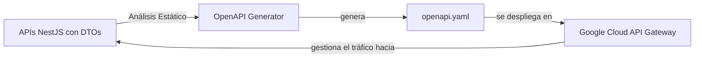

# 🌐 API Gateway con Google Cloud

Esta documentación describe el sistema completo de generación y gestión de API Gateway para Google Cloud usando especificaciones OpenAPI reales extraídas de tus APIs NestJS.

## 📋 Tabla de Contenidos

- [✨ Características Principales](#-características-principales)
- [🏗️ Arquitectura](#️-arquitectura)
- [⚙️ Configuración y Uso](#️-configuración-y-uso)
- [🚀 Uso Rápido](#-uso-rápido)
- [📝 Comandos Disponibles](#-comandos-disponibles)
- [🌍 Variables de Entorno](#-variables-de-entorno)
- [🐛 Troubleshooting](#-troubleshooting)
- [🎯 Mejores Prácticas](#-mejores-prácticas)
- [🔗 Enlaces Útiles](#-enlaces-útiles)
- [🆘 Soporte](#-soporte)

---

## ✨ Características Principales

- ✅ **Descubrimiento por Tags**: Detecta automáticamente las APIs marcadas con el tag `scope:gcp-gateway` en su `project.json`.
- ✅ **Análisis Estático Inteligente**: Usa el compilador de TypeScript para analizar el código fuente de los controladores y DTOs sin necesidad de ejecutar la aplicación.
- ✅ **Generación Automática de Schemas**: Crea automáticamente los `schemas` (modelos de datos) a partir de los DTOs que usas en los decoradores `@Body()` y `@ApiResponse()`.
- ✅ **Conversión a Swagger 2.0**: Convierte la especificación final al formato compatible con Google Cloud API Gateway.
- ✅ **Optimización para Google Cloud**: Añade automáticamente la configuración de backends, seguridad (`x-api-key`) y cuotas.

---

## 🏗️ Arquitectura

El sistema analiza tu código fuente para generar una especificación OpenAPI que Google Cloud puede entender.



**Flujo de trabajo:**

1.  **🔍 Descubrimiento**: El script busca en tu workspace de Nx todos los proyectos que tengan el tag `scope:gcp-gateway`.
2.  **📝 Análisis y Extracción**: Para cada API encontrada, analiza estáticamente los controladores (`*.controller.ts`). Extrae rutas, métodos, parámetros y, lo más importante, los **tipos de los DTOs** usados en `@Body()` y `@ApiResponse()`.
3.  **🏗️ Generación de Schemas**: Convierte cada DTO en un `schema` de OpenAPI, describiendo sus propiedades y si son requeridas.
4.  **🔄 Ensamblaje y Conversión**: Combina toda la información en una única especificación OpenAPI 3.0 y luego la convierte a Swagger 2.0.
5.  **☁️ Optimización y Despliegue**: Añade las extensiones de Google Cloud y despliega la configuración en el API Gateway.

---

## ⚙️ Configuración y Uso

Para que una API sea descubierta y documentada correctamente, debes seguir estos pasos:

### **Paso 1: Configuración Inicial de Google Cloud (Solo una vez)**

Ejecuta el setup inicial una sola vez por proyecto de Google Cloud:

```bash
npm run gcp:setup
```

Este comando:
- ✅ Habilita las APIs de Google Cloud necesarias.
- ✅ Crea una cuenta de servicio con los permisos adecuados.
- ✅ Prepara la base para el API Gateway.

### **Paso 2: Marcar la API con un Tag**

En el archivo `project.json` de la API que quieres exponer, añade el tag `scope:gcp-gateway`.

**Ejemplo: `apps/api-users/project.json`**

```json
{
  "name": "api-users",
  "$schema": "../../node_modules/nx/schemas/project-schema.json",
  // ...
  "tags": ["scope:gcp-gateway"], // <-- ¡AÑADE ESTA LÍNEA!
  "targets": {
    // ...
  }
}
```

### **Paso 3: Definir la URL del Backend**

Define la URL del backend para cada API en tu archivo de entorno (`.env.dev` o `.env.prod`). El sistema asocia la variable con el proyecto `api-*` correspondiente.

```bash
# .env.dev

# La variable USERS_BACKEND_URL se asocia al proyecto `api-users`
USERS_BACKEND_URL=https://api-users-xxx.run.app/api

# La variable ORDERS_DETAIL_BACKEND_URL se asocia a `api-orders-detail`
ORDERS_DETAIL_BACKEND_URL=https://api-orders-detail-xxx.run.app/api
```

### **Paso 4: Documentar con Decoradores (¡Crucial!)**

Para que la generación de schemas funcione, **debes** usar los decoradores `@Body()` y `@ApiResponse()` en tus controladores, especificando el tipo del DTO.

**Ejemplo de controlador:**

```typescript
// En algun-lugar.dto.ts
export class CreateItemDto {
  @IsString()
  name: string;

  @IsInt()
  @IsOptional()
  quantity?: number;
}

// En tu-api.controller.ts
import { CreateItemDto } from './algun-lugar.dto';

@ApiTags('items')
@Controller('items')
export class ItemsController {

  @Post()
  @ApiOperation({ summary: 'Crear un nuevo item' })
  @ApiResponse({ 
    status: 201, 
    description: 'El item ha sido creado exitosamente.',
    type: CreateItemDto // <-- ¡IMPORTANTE! Especifica el DTO de respuesta
  })
  async create(@Body() dto: CreateItemDto): Promise<any> {
    // El tipo del parámetro `dto` (CreateItemDto) se usará para el schema del Request Body.
    // El tipo en `@ApiResponse` se usará para el schema de la respuesta.
  }
}
```

---

## 🚀 Uso Rápido

### **Desarrollo (Flujo completo)**

```bash
# Generar, desplegar y crear gateway en un comando
npm run gateway:dev
```

### **Producción (Flujo completo)**

```bash
# Generar, desplegar y crear gateway para producción
npm run gateway:prod
```

### **Resultado esperado:**

```
🎉 ¡GATEWAY CONFIGURADO EXITOSAMENTE! 🎉

📡 Información del Gateway:
   🏷️  Nombre: mi-empresa-api-dev
   🔗 API: mi-empresa-api
   ⚙️  Config: config-dev-1758118214
   🌍 Región: us-central1
   🔗 URL: https://mi-empresa-api-dev-xxxxx.uc.gateway.dev

🧪 Prueba tus endpoints:
   curl -H "x-api-key: TU_API_KEY" https://mi-empresa-api-dev-xxxxx.uc.gateway.dev/users
   curl -H "x-api-key: TU_API_KEY" https://mi-empresa-api-dev-xxxxx.uc.gateway.dev/orders
```

---

## 📝 Comandos Disponibles

### **Comandos de Alto Nivel (Recomendados)**

| Comando                | Descripción                    | Uso                               |
| ---------------------- | ------------------------------ | --------------------------------- |
| `npm run gateway:dev`  | Flujo completo para desarrollo | Genera + Despliega + Crea gateway |
| `npm run gateway:prod` | Flujo completo para producción | Genera + Despliega + Crea gateway |

### **Comandos Granulares (Para debugging)**

| Comando                        | Descripción                   | Cuándo usar                  |
| ------------------------------ | ----------------------------- | ---------------------------- |
| `npm run openapi:generate:dev` | Solo generar spec             | Verificar contenido del spec |
| `npm run gateway:deploy:dev`   | Solo crear config en GCP      | Probar validación de Google  |
| `npm run gateway:create:dev`   | Solo crear/actualizar gateway | Cambiar config sin regenerar |

---

## 🌍 Variables de Entorno

Crea los archivos de entorno basándote en los ejemplos: `cp .env.development.example .env.dev`.

### **Variables Requeridas**

Todas las siguientes variables son **obligatorias**:

```bash
# URLs de tus APIs (patrón: *_BACKEND_URL)
USERS_BACKEND_URL=https://api-users-xxx.run.app/api
ORDERS_DETAIL_BACKEND_URL=https://api-orders-detail-xxx.run.app/api

# Configuración del gateway
GATEWAY_API_NAME=mi-empresa-api           # Nombre del API en Google Cloud
BACKEND_PROTOCOL=https                    # http para dev, https para prod
GATEWAY_TITLE="Mi API Gateway"
GATEWAY_DESCRIPTION="Descripción del gateway"
GATEWAY_VERSION=1.0.0
OPENAPI_OUTPUT_FILE=openapi-gateway.yaml
ENVIRONMENT=dev                           # dev o prod

# Configuración de Google Cloud
GCP_PROJECT_ID=mi-proyecto-123         # ID del proyecto en Google Cloud
```

---

## 🐛 Troubleshooting

#### **Mi API no aparece en el `openapi.yaml` generado.**

1.  **Verifica el Tag**: ¿Has añadido `"tags": ["scope:gcp-gateway"]` al `project.json` de tu API?
2.  **Verifica la URL**: ¿Has definido la variable `*_BACKEND_URL` correspondiente en tu archivo `.env`?

#### **El `body` de mi petición o la respuesta aparece como un objeto vacío `{}`.**

1.  **Verifica el `@Body()`**: ¿Tu método del controlador tiene un parámetro decorado con `@Body()` y su tipo es una clase DTO (ej. `@Body() dto: MiDto`)?
2.  **Verifica el `@ApiResponse()`**: ¿Has añadido la propiedad `type: MiDtoDeRespuesta` al decorador `@ApiResponse`?
3.  **Verifica la importación**: ¿El DTO está correctamente importado en el archivo del controlador?

#### **Error: "Location ... is not found or access is unauthorized"**

- API Gateway no está disponible en todas las regiones. El script usa `us-central1` por defecto, que es una región válida.

### **Comandos de Diagnóstico de `gcloud`**

```bash
# Ver configuraciones existentes
gcloud api-gateway api-configs list --api=${GATEWAY_API_NAME}

# Ver gateways existentes
gcloud api-gateway gateways list --location=us-central1

# Ver logs del último deploy
gcloud logging read "resource.type=api_gateway" --limit=50
```

### **Validación Manual del Spec**

1.  Ejecuta `npm run openapi:generate:dev`.
2.  Abre el archivo `openapi-gateway.yaml`.
3.  Copia su contenido y pégalo en [Swagger Editor](https://editor.swagger.io/) para visualizarlo y validarlo.

---

## 🎯 Mejores Prácticas

- **Flujo de Desarrollo**: Desarrolla tu API, despliégala a Cloud Run, actualiza la URL en el `.env` y finalmente regenera el gateway con `npm run gateway:dev`.
- **Gestión de Entornos**: Usa `.env.dev` para desarrollo y `.env.prod` para producción. Nunca subas a git archivos `.env` con datos reales.
- **Monitoreo**: Usa Google Cloud Console para ver métricas y configurar alertas en el API Gateway.

---

## 🔗 Enlaces Útiles

- [Google Cloud API Gateway Docs](https://cloud.google.com/api-gateway/docs)
- [OpenAPI 3.0 Specification](https://swagger.io/specification/)
- [NestJS Swagger Module](https://docs.nestjs.com/openapi/introduction)

---

## 🆘 Soporte

Si encuentras problemas, sigue estos pasos:
1. Revisa los logs del comando que falló.
2. Consulta la sección de `Troubleshooting` de este documento.
3. Verifica tu configuración de variables de entorno.
4. Ejecuta los comandos de diagnóstico de `gcloud`.
